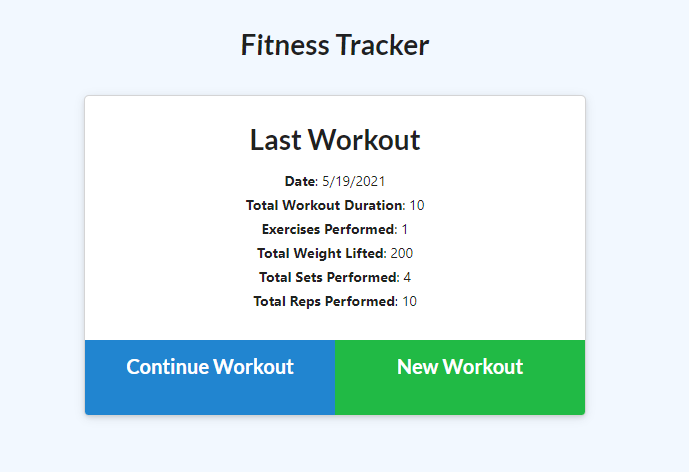
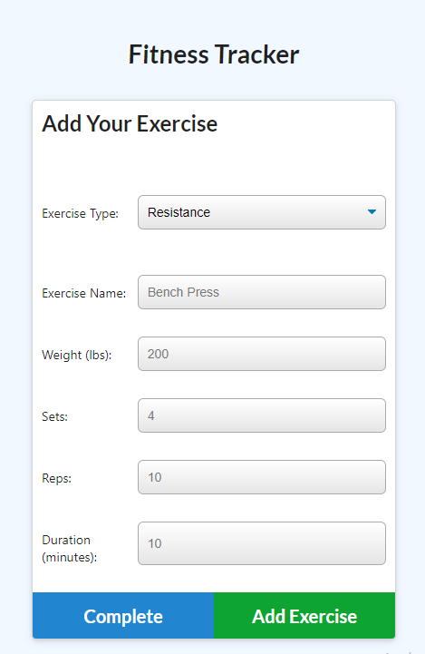
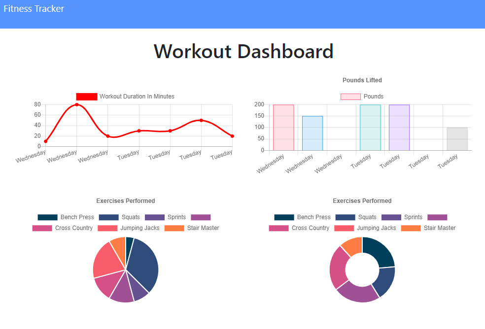

# Workout Tracker

[Description](#description) 

[Ideal User](#ideal-user)

[Installation Instructions](#installation-instructions) 

[Site Overview](#site-overview) 
  

[Contribution Guidelines](#contribution-guidelines) 

[Tests](#tests) 
 
[Questions](#questions)

## Description

Hosted on Heroku: https://gentle-meadow-37672.herokuapp.com/

This app is designed for a user that is interested in keeping track of their exercises so they can monitor progress and continue to improve.  The app was developed using HTML, CSS, Javascript, Express.js, and MongoDB.  It is hosted using Heroku and AtlasDB.  

Chart.js is used to provide the user a stylish and efficient way of viewing their progress both in terms of the duration of their workouts and the amount of weight they lifted during them.  The dashboard will show the user the last 7 exercises they have performed so they can continue to monitor their progress.  
  

## Ideal User

This application is aimed at a user who is looking to 
work out with both cardio and resistance training and wants a place to log and view their progress
so they can continue to improve and monitor their development as an athlete or health conscious individual.

## Installation Instructions

No need to install this application! If you want to clone or fork it to your local device feel free, otherwise it is available via github pages and can be found at the following link: https://gentle-meadow-37672.herokuapp.com/

## Site Overview

Upon accessing the application from the link above, the user is given the option to log a new workout or continue an existing workout, while also displaying their previous workout.  If there is no workouts logged previously, it will inform the user as to such and only give them the option to add a new workout.  

If the user clicks to add a new workout, they will be greeted with a screen that asks them whether the exercise is cardio based or resistance based.  Depending on which they pick, they will be asked different questions such as exercise name, duration, weight lifted, etcetera.  

Once all of the fields are filled in, the user can either add another exercise to their overall workout or complete the workout for the day.  When the user completes the workout, it will log the information and the user can view their activity on the dashboard.  The activity is rendered graphically using Chart.js and will show the past 7 workouts.  

## License

This application uses the MIT license

## Contribution Guidelines

If you would like to contribute to this project feel free to send requests.  I only wish that you be respectful to other contributes and to the code itself and maintain good clean coding practices. 

### Questions

If you have any questions about the application, be sure to contact me at my [e-mail](mailto:smonagha@conncoll.edu).

Alternatively you can find me and my other works at my [Github account](https://github.com/seanmonaghan).
